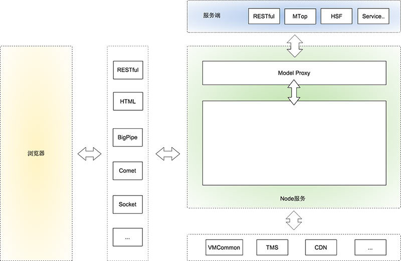

# 前后端分离

康威定律:  设计系统的组织，其产生的设计和架构等价于组织间的沟通结构

- 从物理层做区分

SPA式的前后端分离, 客户端的就是前端，服务器端的就是后端

- 从职责上划分

前端：负责View和Controller层。后端：只负责Model层，业务处理/数据等

    淘宝宝贝详情页静态化之后，还是有不少需要实时获取的信息，比如物流、促销等等，因为这些信息在不同业务系统中，所以需要前端发送5，6个异步请求来回填这些内容。
    有了NodeJS之后，前端可以在NodeJS中去代理这5个异步请求，还能很容易的做Bigpipe,这块的优化能让整个渲染效率提升很多。

## arch

Node应用中有一层Model Proxy与服务端进行通讯。这一层主要目前是抹平我们对不同接口的调用方式，封装一些view层需要的Model。

